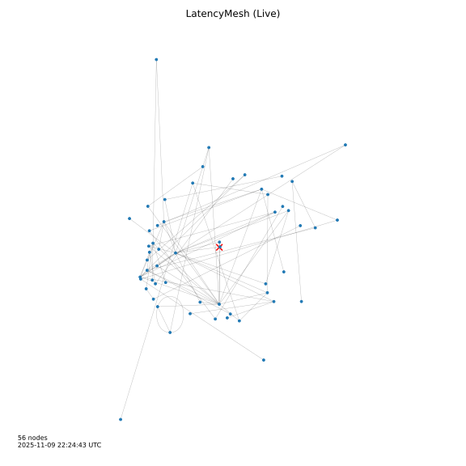

[](https://github.com/seanwevans/Latency-Mesh/actions/workflows/ci.yml)

# 🕸️ LatencyMesh (`lm`)

**LatencyMesh** continuously performs asynchronous traceroutes to map the topology of your surrounding Internet in real time.
It constructs a **weighted mesh** where each edge corresponds to a hop and its latency.
Over time, it reveals the structure of your network neighborhood.



## 🚀 Usage

Install the project in an isolated Python environment (Python 3.11+ is required) and invoke the command line interface via the `lm` entry point:

```bash
python -m pip install .
lm --help
```

The CLI exposes several subcommands that operate on live traceroute scans and stored graphs.

- `lm scan` — launch an asynchronous traceroute sweep. Results are written to JSON graph files that can be visualized or exported later. Use `--no-display` for headless environments, adjust concurrency with flags such as `--workers`, `--pps`, and `--max-hops`, or stop automatically with `--duration` / `--max-traces`.
- `lm show` — render a saved graph (`.json`) using layouts like `radial`, `spring`, or `planar`. An SVG snapshot is produced when `--output` is supplied.
- `lm export` — convert a stored graph to `gexf` or `csv` for further analysis.
- `lm stats` — summarize hop counts, latencies, and metadata in a graph file.
- `lm prune` — drop stale or low-quality nodes (e.g., `--older-than 7d`).
- `lm merge` — combine multiple graph snapshots into a single mesh.
- `lm seed` — list default seed IPs or augment them with manual entries.
- `lm serve` — launch the asynchronous web API and D3.js dashboard (see below).

## 🌐 Web interface

`lm serve` starts the FastAPI-powered control plane together with the live D3 visualization. The command reuses the scanning
flags from `lm scan`, so you can control concurrency (`--workers`), rate limits (`--pps`), and the output base name (`--save-base`).

```bash
lm serve --host 0.0.0.0 --port 8000 --workers 8 --pps 2.0
```

While the scan runs, the server exposes:

- `GET /` — the bundled dashboard (served from `latencymesh/webapp/static/`).
- `GET /api/graph` — a JSON snapshot containing the nodes and edges of the current graph.
- `GET /api/stats` — aggregate metrics (node/edge counts, average degree, latency) with the current version number.
- `GET /api/stream` — a server-sent events (SSE) channel that streams incremental graph snapshots as `scan_async` discovers
  new paths.

Each update reuses the in-memory networkx graph; the async workers broadcast through an internal queue so connected clients
stay in sync without polling.

## 🧱 Build instructions

LatencyMesh uses a standard `setuptools` build pipeline. After cloning the repository, install the optional development dependencies and produce distribution artifacts with `python -m build`:

```bash
python -m pip install --upgrade pip
python -m pip install .[dev]
python -m build
```

The command emits wheel (`.whl`) and source (`.tar.gz`) distributions under `dist/`. You can verify the metadata before publishing via:

```bash
python -m pip install twine
twine check dist/*
```

## ✅ Continuous integration

GitHub Actions runs three jobs on pushes, pull requests, and manual dispatches:

1. **Format** — installs Python 3.11 and runs `black .`, auto-committing any formatting updates.
2. **Tests** — installs the project with the `[test]` extras and executes `pytest --cov=latencymesh --cov-report=term-missing --cov-report=xml`, uploading `coverage.xml` as an artifact.
3. **Build** — builds the distribution with `python -m build` and validates metadata using `twine check`.

To mirror the workflow locally, run:

```bash
black .
pytest --cov=latencymesh --cov-report=term-missing
python -m build && twine check dist/*
```
